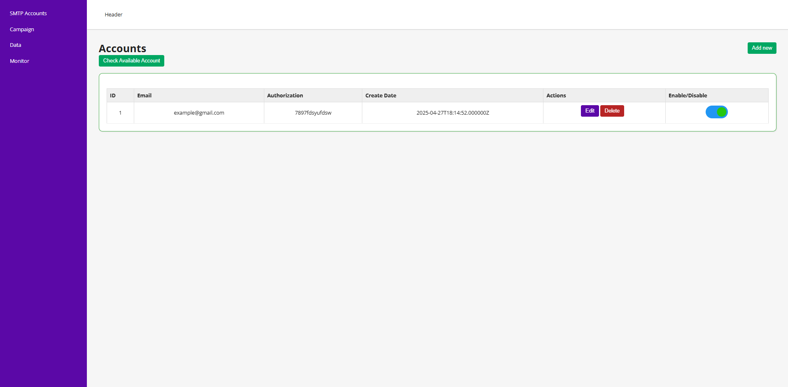
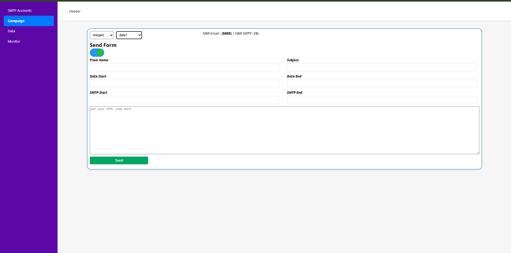

# **Project Documentation**

## **Introduction**
This project is a backend email processing and management system designed to manage SMTP accounts, send batch emails, and handle email data processing. It supports features such as checking the availability of SMTP accounts, sending batch emails, managing SMTP accounts, and managing email-related data.

---

## **Database and Relationships**

### **Tables**

1. **`smtp_accounts`**
    - **Purpose:** Stores SMTP account details such as email credentials, host, port, and encryption.
    - **Columns:**
        - `id` (Primary Key)
        - `email` (Unique, String)
        - `password` (String)
        - `port` (Integer)
        - `host` (String)
        - `active` (Boolean)
        - `encryption` (String)
        - `created_at` (Timestamp)
        - `updated_at` (Timestamp)

2. **`client_emails`**
    - **Purpose:** Stores client email data.
    - **Columns:**
        - `id` (Primary Key)
        - `email` (String)
        - `active` (Boolean)
        - `created_at` (Timestamp)
        - `updated_at` (Timestamp)

3. **`emails`**
    - **Purpose:** Stores email information related to data.
    - **Columns:**
        - `id` (Primary Key)
        - `id_data` (Foreign Key)
        - `email` (String)
        - `active` (Boolean)
        - `created_at` (Timestamp)
        - `updated_at` (Timestamp)
    - **Foreign Key:**
        - `id_data` references `data.id` (Cascade delete)

4. **`job_batches`**
    - **Purpose:** Manages batches of jobs.
    - **Columns:**
        - `id` (Primary Key)
        - `name` (String)
        - `total_jobs` (Integer)
        - `pending_jobs` (Integer)
        - `failed_jobs` (Integer)
        - `failed_job_ids` (LongText)
        - `options` (MediumText, Nullable)
        - `cancelled_at` (Integer, Nullable)
        - `created_at` (Integer)
        - `finished_at` (Integer, Nullable)

5. **`jobs`**
    - **Purpose:** Stores job information for the queue.
    - **Columns:**
        - `id` (Primary Key)
        - `queue` (String)
        - `payload` (LongText)
        - `attempts` (Unsigned Tiny Integer)
        - `reserved_at` (Unsigned Integer, Nullable)
        - `available_at` (Unsigned Integer)
        - `created_at` (Unsigned Integer)

6. **`drops`**
    - **Purpose:** Logs details about email drops.
    - **Columns:**
        - `id` (Primary Key)
        - `status` (String)
        - `data` (String)
        - `range_acc` (String)
        - `range_email` (String)
        - `subject` (String)
        - `from_name` (String)
        - `html_content` (Text)
        - `created_at` (Timestamp)
        - `updated_at` (Timestamp)

7. **`data`**
    - **Purpose:** Stores email data information.
    - **Columns:**
        - `id` (Primary Key)
        - `name` (String)
        - `isp` (String)
        - `created_at` (Timestamp)
        - `updated_at` (Timestamp)

---

## **Routes and Their Purpose**

### **Email Routes**

- **POST `/email/send`**
    - **Controller:** `EmailController@sendBatchEmails`
    - **Purpose:** Initiates sending/testing a batch of emails .

### **Accounts Routes**

- **GET `/accounts/check_available`**
    - **Controller:** `EmailController@checkAvailableAccount`
    - **Purpose:** Checks the availability of SMTP accounts.

- **GET `/accounts`**
    - **Controller:** `SmtpAccountController@index`
    - **Purpose:** Lists all SMTP accounts.

- **GET `/accounts/{id}`**
    - **Controller:** `SmtpAccountController@getUser`
    - **Purpose:** Retrieves a specific SMTP account by ID.

- **POST `/accounts`**
    - **Controller:** `SmtpAccountController@store`
    - **Purpose:** Creates a new SMTP account.

- **PUT `/accounts/{id}`**
    - **Controller:** `SmtpAccountController@update`
    - **Purpose:** Updates an existing SMTP account.

- **DELETE `/accounts/{id}`**
    - **Controller:** `SmtpAccountController@delete`
    - **Purpose:** Deletes an SMTP account.

### **Drops Routes**

- **GET `/drops`**
    - **Controller:** `DropController@index`
    - **Purpose:** Lists all email drop logs.

### **Data Routes**

- **GET `/get_data`**
    - **Controller:** `DataController@get_data`
    - **Purpose:** Retrieves all category data.

- **POST `/get_data_emails`**
    - **Controller:** `DataController@get_data_emails`
    - **Purpose:** Retrieves emails based on the data.

- **POST `/data/upload`**
    - **Controller:** `DataController@uploadData`
    - **Purpose:** Uploads email data.

- **GET `/data/get_email`**
    - **Controller:** `DataController@search_by_email`
    - **Purpose:** Searches for email data.

- **DELETE `/data/delete_email`**
    - **Controller:** `DataController@delete_email`
    - **Purpose:** Deletes an email from the data.

- **POST `/data/get_data_count`**
    - **Controller:** `DataController@dataCount`
    - **Purpose:** Retrieves the count of data entries.

---

## **Queue Jobs**

- **Connection Test Job (`ConnctionTestJob`)**
    - **Purpose:** Tests the connectivity of SMTP accounts.

- **Send Email Job (`SendEmailJob`)**
    - **Purpose:** Sends individual emails as part of a batch.

- **Send Batch Emails Job (`SendBatchEmailsJob`)**
    - **Purpose:** Manages sending multiple emails in a batch.

---
# **Project Setup Guide**

## **Backend Setup (Laravel + Docker)**

### **Requirements:**
- Docker
- Laravel Sail
- Composer

### **Steps to Set Up the Backend:**

1. **Set up the environment file:**
    ```bash
    cp .env.example .env
    ```

2. **Build the Docker containers:**
    ```bash
    ./vendor/bin/sail build
    ```

3. **Start Sail (Laravel Docker):**
    ```bash
    ./vendor/bin/sail up
    ```

4. **Run migrations:**
    ```bash
    ./vendor/bin/sail artisan migrate
    ```

5. **Install dependencies:**
    ```bash
    ./vendor/bin/sail composer install
    ```

6. **Access the backend at** `http://localhost`.

---

## **Frontend Setup (React + Node)**

### **Requirements:**
- Docker
- Docker Compose

### **Steps to Set Up the Frontend:**

1. **Clone the repository (if not already cloned):**
    ```bash
    cd ./frontend
    ```

2** Start the frontend container using Docker Compose:**
    ```bash
    docker-compose up --build
    ```

4. **Access the frontend at** `http://localhost:3000` (or the appropriate port if different).

---
** Test Example ** 




## **Conclusion**

This project combines a Laravel-based backend for email management and a React frontend for user interaction. It is deployed using Docker to provide a containerized environment. The backend handles tasks such as SMTP account management, sending batch emails, and email data processing. The frontend interacts with the backend API to manage these tasks.
