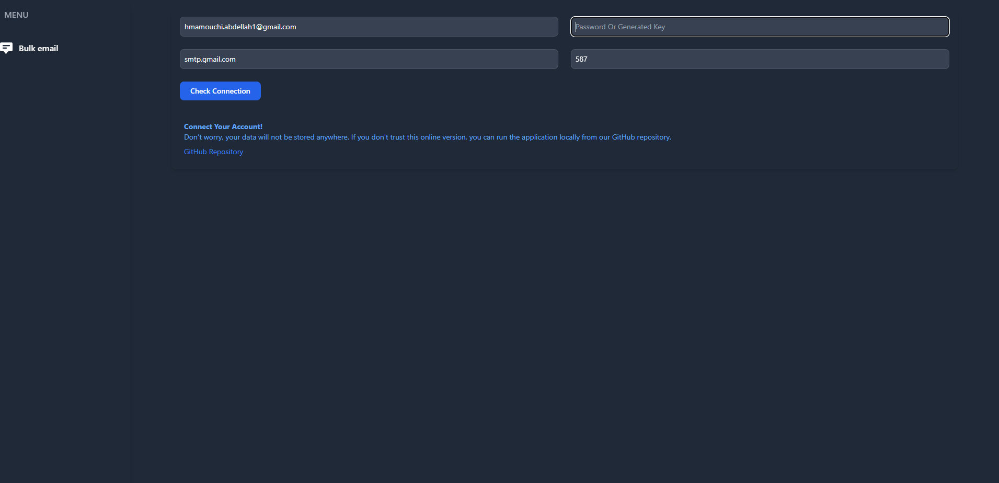
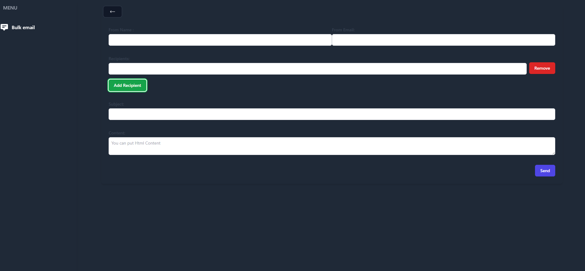

# 📧 Laravel Livewire Mailer

A lightweight, privacy-respecting Laravel application that sends **HTML emails** to multiple recipients using **custom SMTP credentials** – all without storing anything on the server. Uses **Livewire** for frontend interactivity, **Laravel Jobs** for background processing, and runs entirely on **Docker with Laravel Sail**. Perfect for one-off email dispatching!

---

## 🚀 Features

- ✅ Send emails using user-provided SMTP config (host, port, email, app password)
- 📧 Supports multiple recipients
- 📝 HTML format email body
- 🔒 Does **not** store any data (stateless by design)
- ⚙️ Background job dispatch using Laravel Queues
- 🐳 Docker + Laravel Sail for dev environment
- ⚡ Vite + npm for frontend asset management
- ✅ WSL (Ubuntu) friendly setup

---

## 🖥️ Requirements (Windows + WSL 2)

- Windows 10/11 with WSL2 (Ubuntu)
- Docker Desktop
- Git
- No need to install PHP, Composer, or Node on Windows

---

## 💡 How It Works

1. User enters SMTP credentials (host, port, app password).
2. The app checks the connection.
3. If valid, the user is redirected to the email form.
4. The user enters:
    - Subject
    - Recipients
    - HTML message body
5. Email is queued to be sent in the background using Laravel Jobs.

---

## 🧰 Background Jobs (Queue System)

We use Laravel's **database queue driver** to send emails asynchronously.

Make sure the following is in `.env`:

```env
QUEUE_CONNECTION=database
```

To run the queue worker:

```bash
./vendor/bin/sail artisan queue:work
```

> Migrations include:
- `jobs`
- `job_batches`
- `failed_jobs`

---

## 🔐 Security

✅ Privacy-first by design:

- SMTP credentials are **never stored** in the database.
- Emails are composed and sent in a single session.
- Database only stores queue metadata temporarily.

---

## 🧪 Testing SMTP

Use temporary/test SMTP services like:

- [Mailtrap.io](https://mailtrap.io)
- [Ethereal Email](https://ethereal.email)

These services let you test without sending real emails.

---

## 🧱 Tech Stack

| Layer       | Tool                    |
|-------------|-------------------------|
| Backend     | Laravel 10              |
| Frontend    | Livewire + Tailwind CSS |
| Queue       | Laravel Jobs (Database) |
| Dev Env     | Laravel Sail (Docker)   |
| Build Tool  | Vite + npm              |

---

## 🛠 Installation (WSL + Docker + Sail)

1. **Clone the repository**

```bash
git clone https://github.com/Abd-Lah/bulk_emails_using_box
cd ./single
```

2. **Install dependencies and setup environment**

```bash
cp .env.example .env
docker-compose up
docker ps [copy the id of the laravel-sail]
docker exec -it [paste the id of the container] bash
composer install
```
**Run in bash laravel.sail container**

3.**Generate app key and migrate queue tables**

```bash
php artisan key:generate
php artisan migrate
```

**Install npm packages and build frontend assets**

```bash
npm install
npm run dev
```

4**Access the app**
afer installing dependencies
stop container 
    docker-compose down
and start using laravel sail
    ./vendor/bin/sail up
Visit: [http://localhost](http://localhost)

---
---
**Test**



## 📦 Useful Commands

```bash
# Start Sail (Docker)
./vendor/bin/sail up -d

# Stop Sail
./vendor/bin/sail down

# Run queue worker
./vendor/bin/sail artisan queue:work

# Rebuild assets
./vendor/bin/sail npm run build
```

---

## 🧑‍💻 Contributing

Feel free to fork, modify, and contribute to the project via pull requests. All feedback is welcome!
